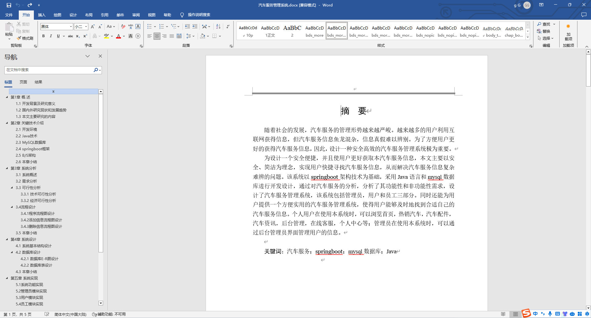
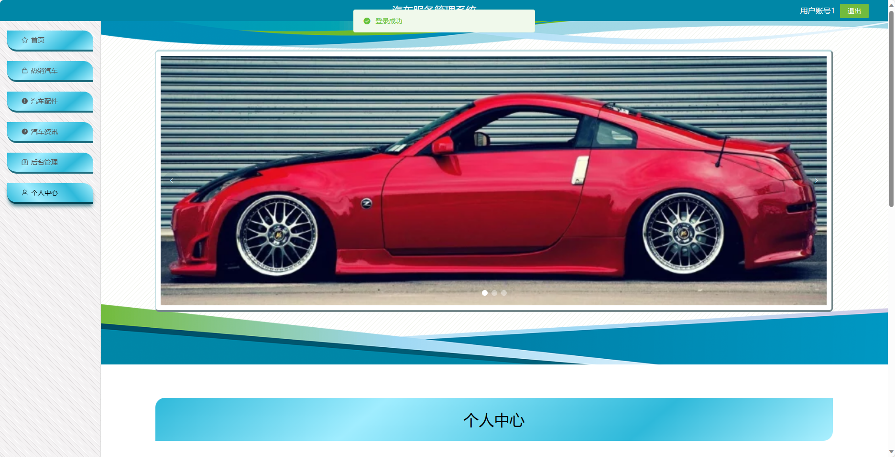
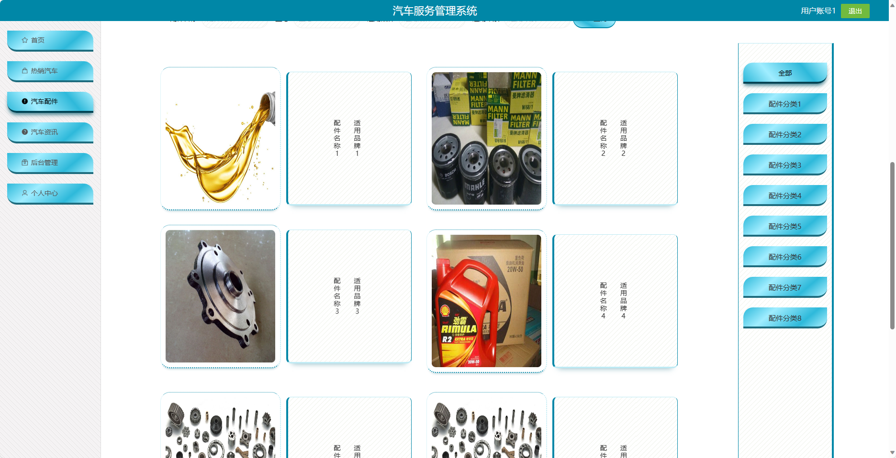
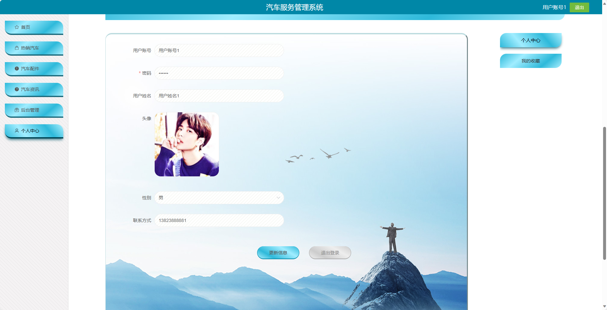
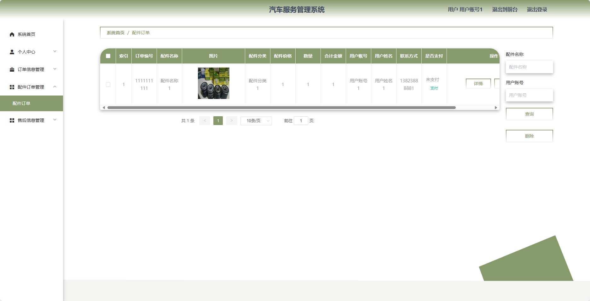
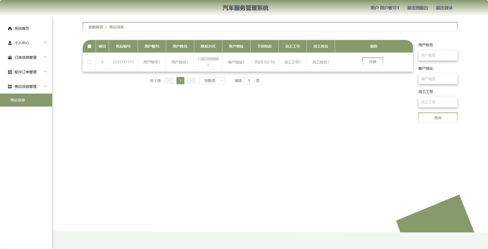
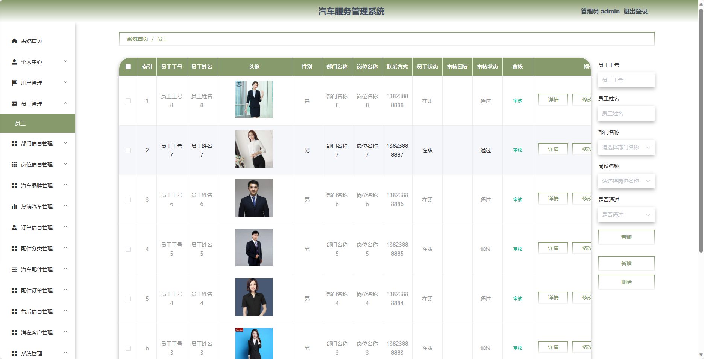
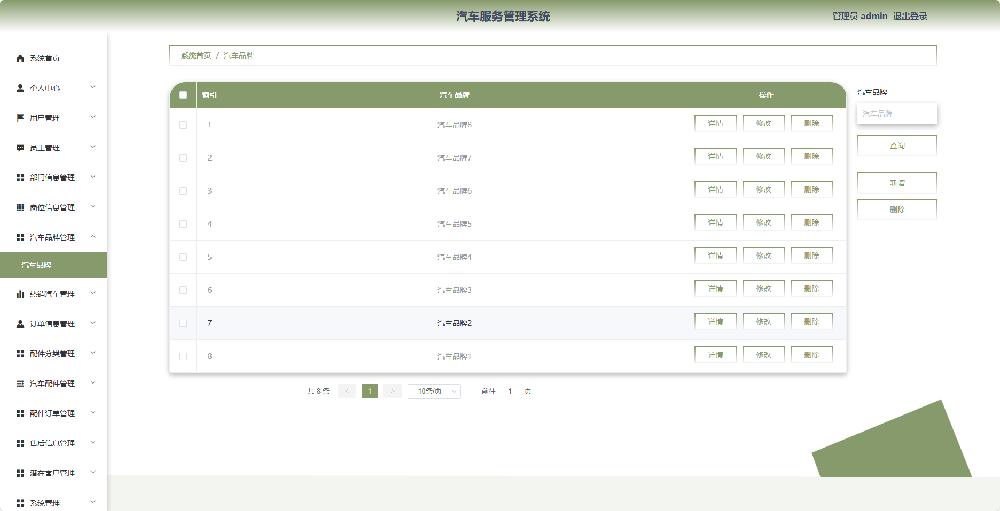
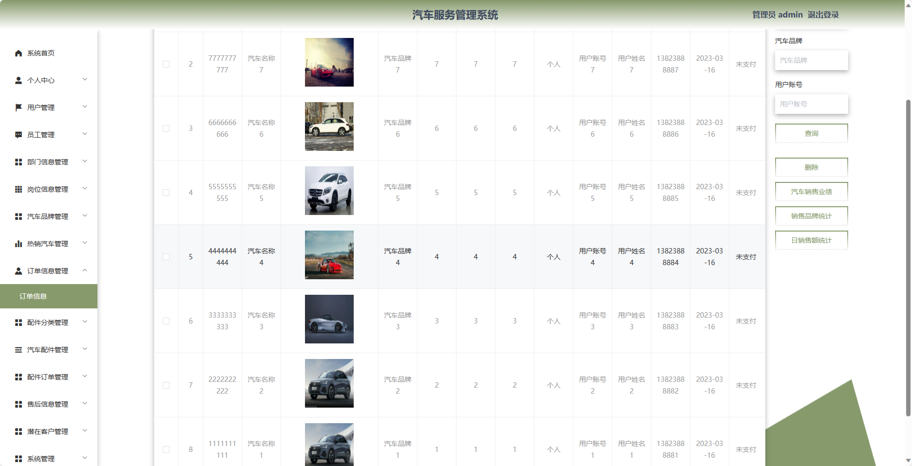
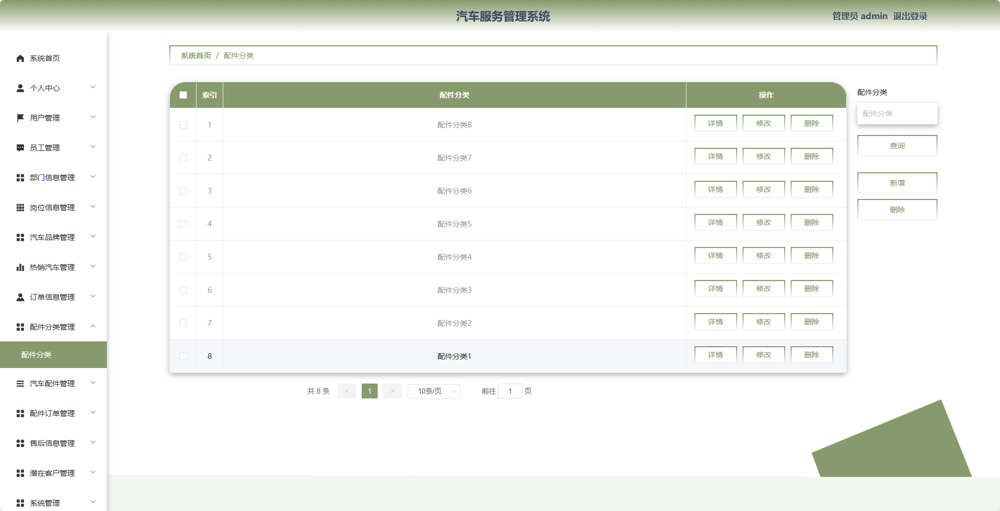

## 基于SpringBoot的汽车服务管理系统(程序+报告)

###  获取sql数据库文件: 从戎源码网 (https://armycodes.com/) QQ: 386869957 QQ群: 377586148
###  所有系统地址: (https://github.com/YuLin-Coder/AllProjectCatalog) 
###  所有项目以及源代码本人均调试运行无问题 可支持远程安装部署调试、定制修改、代码讲解

## 项目介绍
基于SpringBoot的汽车服务管理系统，系统包含三种角色：管理员、员工、用户,系统分为前台和后台两大模块，主要功能如下。

### 【管理员】:
1. 个人中心：管理员可以管理个人信息，包括修改密码等操作。
2. 用户管理：管理员可以管理系统用户信息，包括查看用户列表、添加、编辑、删除等操作。
3. 员工管理：管理员可以管理员工信息，包括查看员工列表、添加、编辑、删除等操作。
4. 部门信息管理：管理员可以管理部门信息，包括查看部门列表、添加、编辑、删除等操作。
5. 岗位信息管理：管理员可以管理岗位信息，包括查看岗位列表、添加、编辑、删除等操作。
6. 汽车品牌管理：管理员可以管理汽车品牌信息，包括查看品牌列表、添加、编辑、删除等操作。
7. 热销汽车管理：管理员可以管理热销汽车信息，包括查看热销汽车列表、添加、编辑、删除等操作。
8. 订单信息管理：管理员可以管理用户订单信息，包括查看订单列表、处理退款、发货等操作。
9. 配件分类管理：管理员可以管理配件分类信息，包括查看分类列表、添加、编辑、删除等操作。
10. 汽车配件管理：管理员可以管理汽车配件信息，包括查看配件列表、添加、编辑、删除等操作。
11. 配件订单管理：管理员可以管理用户配件订单信息，包括查看订单列表、处理退款、发货等操作。
12. 售后信息管理：管理员可以管理用户售后服务信息，包括查看申请列表、处理退款、安排维修等操作。
13. 潜在客户管理：管理员可以管理潜在客户信息，包括查看客户列表、添加、编辑、删除等操作。
14. 系统管理：管理员可以管理系统的参数设置、日志查看等功能。

### 【用户】:
1. 个人中心：用户可以管理个人信息。
2. 订单信息管理：用户可以查看自己的订单信息。
3. 配件订单管理：用户可以查看自己的配件订单信息。
4. 售后信息管理：用户可以提交售后服务请求，包括退款、维修等。

### 员工：
- 个人中心：员工可以管理个人信息，包括修改密码等操作。
- 热销汽车管理：员工可以查看热销汽车信息。
- 订单信息管理：员工可以查看订单信息。
- 汽车配件管理：员工可以查看汽车配件信息。
- 配件订单管理：员工可以查看配件订单信息。
- 售后信息管理：员工可以查看售后服务请求信息。

### 【前台】:
1. 首页：展示系统的概览信息。
2. 热销汽车：展示热门的汽车销售信息。
3. 汽车配件：展示各类汽车配件信息。
4. 汽车资讯：提供最新的汽车行业资讯、车型评测、保养知识等。

## 项目技术
- 编程语言：Java
- 数据库：MySQL
- 项目管理工具：Maven
- 前端技术：HTML、CSS、JavaScript、Jquery、Vue
- 后端技术：Spring、SpringMVC、MyBatis

## 运行环境
- JDK版本：JDK1.8及以上
- 开发工具：IDEA、Ecplise、Myecplise都可以
- 数据库: MySQL5.7及以上
- Maven：maven3.0及以上
- Node：14.14.0及以上

## 运行截图

